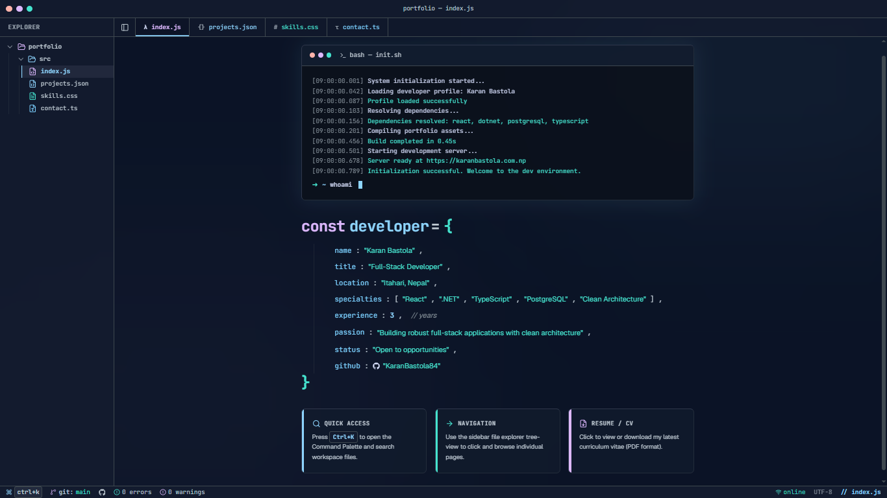

# karanbastola.com.np - VS Code Inspired Portfolio

A highly interactive, developer-focused portfolio designed to look and feel like the **Visual Studio Code** editor. Built with modern web technologies, it features an interactive file explorer, functioning command palette, syntax-highlighted themes, and a fully working contact form.

 

## 🚀 Features

- **VS Code Theme & Layout:** Authentic editor layout with an Explorer sidebar, editor tabs, and a status bar.
- **Interactive File Explorer:** Navigate through different "files" (`index.js`, `projects.json`, `skills.css`, `contact.ts`) to view the portfolio sections.
- **Command Palette:** Press <kbd>Ctrl+K</kbd> to open a fuzzy-search command palette to jump between files quickly.
- **Terminal Boot Sequence:** Features a simulated system initialization log sequence on the homepage.
- **Functional Contact Form:** `contact.ts` serves as a "commit"-based form linked to **EmailJS** to send real emails directly from the UI.
- **Responsive Design:** Carefully crafted Tailwind CSS layout that adapts flawlessly from ultra-wide monitors down to mobile screens.
- **IDE Status Bar:** Live status indicators, syntax information, and quick links to GitHub.

## 🛠️ Tech Stack

- **Framework:** [React 19](https://react.dev/) + [Vite](https://vitejs.dev/)
- **Styling:** [Tailwind CSS v4](https://tailwindcss.com/)
- **Icons:** [Lucide React](https://lucide.dev/) & [React Icons](https://react-icons.github.io/react-icons/)
- **Language:** TypeScript
- **Email Service:** [EmailJS](https://www.emailjs.com/)

## ⚙️ Local Development

### 1. Clone the repository

```bash
git clone https://github.com/KaranBastola84/portfolio.git
cd portfolio
```

### 2. Install dependencies

```bash
npm install
```

### 3. Configure Environment Variables

Create a `.env` file in the root of your project and add your EmailJS configuration:

```env
VITE_EMAILJS_SERVICE_ID="your_service_id"
VITE_EMAILJS_TEMPLATE_ID="your_template_id"
VITE_EMAILJS_PUBLIC_KEY="your_public_key"
```

### 4. Start the development server

```bash
npm run dev
```

The application will be available at `http://localhost:5173`.

## 📁 Project Structure

```text
├── public/                 # Static assets (CV, images)
├── src/
│   ├── components/         # Reusable IDE components (Sidebar, Tabs, StatusBar)
│   ├── data/               # Project data, skills, and terminal logs (portfolio.ts)
│   ├── pages/              # Portfolio sections (Index, Projects, Skills, Contact)
│   ├── App.tsx             # Main application and layout wrapper
│   ├── index.css           # Global theme variables & Tailwind layer
│   └── main.tsx            # React mount point
```

## 📬 Contact Form Setup (EmailJS)

To get the contact form working on your own fork:

1. Create a free account at [EmailJS](https://www.emailjs.com/).
2. Setup an Email Service (e.g., connecting your Gmail).
3. Create an Email Template. The variables passed from the code are:
   - `senderName`
   - `email`
   - `body`
4. Copy your Service ID, Template ID, and Public Key into the `.env` file.

## 👨‍💻 Author

**Karan Bastola**

- Full-Stack Developer
- location: Itahari, Nepal
- GitHub: [@KaranBastola84](https://github.com/KaranBastola84)

---

_Built with passion and clean architecture._
